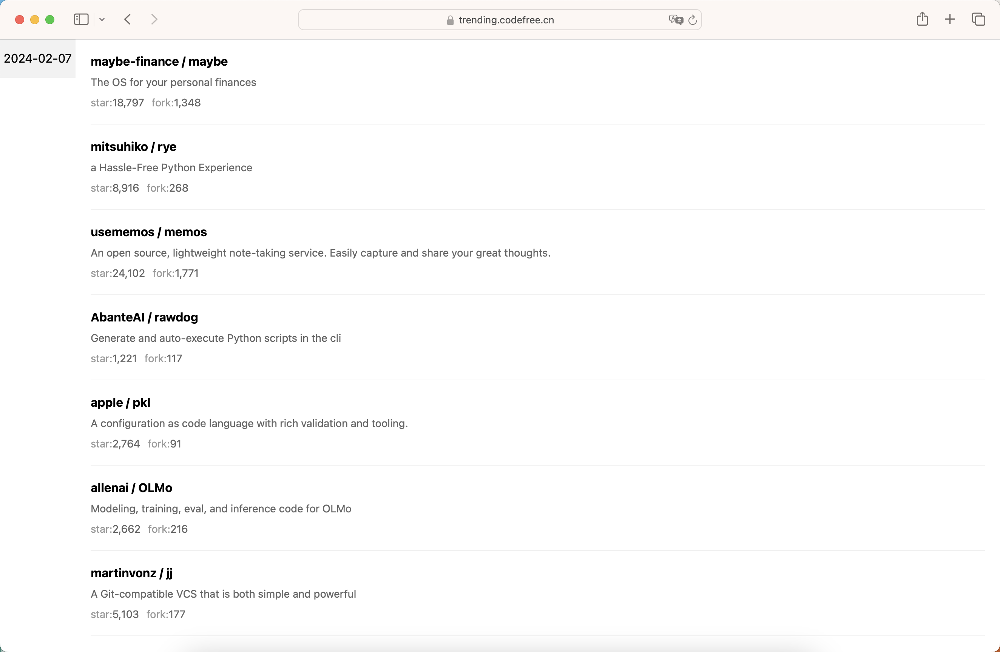

# github热榜归档

> 将每日的github热榜归档到本地，并使用docker部署。

## 运行 BUILD & RUN

```shell
# 打包镜像
docker build -t github-trending .
# 运行镜像
docker run -d \
  --name github-trending \
  -p 8080:80 \
  -v $HOME/dockerdata/trending/data:/app/dist \
  -v /etc/timezone:/etc/timezone:ro \
  -v /etc/localtime:/etc/localtime:ro \
  -e EXEC_PER_HOUR=1 \
  -e MAX_RETRY=10 \
  github-trending
```

## 截图 Snapshot

